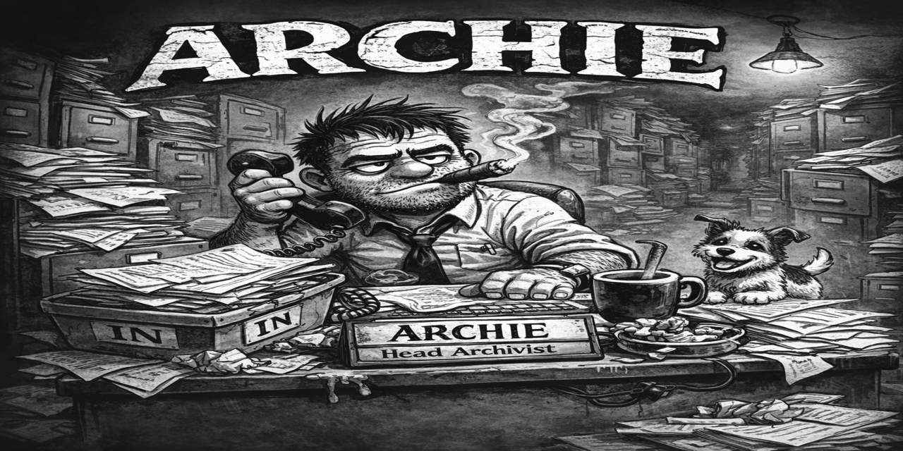

# ARCHIE'S ARCHIVAL ARRAY

ARCHIE.sh is a standalone archival reduction tool designed to shrink video files efficiently while preserving usable quality.

ARCHIE works at the directory level, processes batches safely, and provides clear, human-readable feedback at every step.

ARCHIE is not a forensic tool. It is built for media that no longer requires evidentiary-grade integrity.

---

## PURPOSE

ARCHIE exists to:

- reduce storage footprint of video collections  
- process large batches safely and repeatably  
- ensure every output justifies its existence  

---

## CORE PRINCIPLES

- Non-destructive by default  
- Outputs must prove they earned their keep  
- If it doesn’t shrink, it doesn’t survive  
- All destructive actions require explicit confirmation  

---

## KEY FEATURES

### Archival Re-Encode Engine

ARCHIE processes video files in the current directory and produces reduced-size archival copies.

Four levels are available:

| Level | Description |
|------|-------------|
| L1 | Light shrink (higher quality, larger files) |
| L2 | Balanced (recommended default) |
| L3 | Aggressive compression |
| L4 | Maximum shrink (storage-first priority) |

All outputs are encoded using `libx264` with tuned presets per level.

---

### Intelligent Size Gate

Every output must pass a strict size test:

- If the output is not smaller than the original, it is deleted  
- Optional tolerance allows minor overhead (container differences)  

ARCHIE never keeps useless results.

---

### Resume-Safe Processing

ARCHIE safely resumes interrupted runs:

- detects existing outputs  
- skips completed files  
- avoids duplicate work  
- maintains accurate batch statistics  

Critical for long-running jobs.

---

### Audio Handling Modes

| Mode | Behavior |
|------|----------|
| copy | Preserve original audio |
| aac  | Re-encode to AAC |
| strip | Remove audio entirely |

---

### Metadata Handling

| Mode | Behavior |
|------|----------|
| sidecar_strip | Save metadata externally, strip output |
| restore_common | Preserve common metadata |
| minimal_skip | Skip metadata capture |

Sidecars are stored in:
